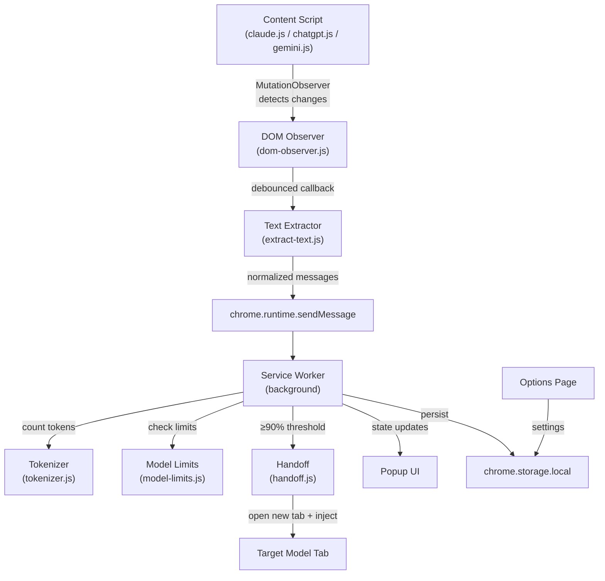

# AI Token Tracker & Switcher — Chrome Extension (MV3)

Build a Chrome Extension that tracks token usage across Claude, ChatGPT, and Gemini conversations. When a conversation approaches the model's context limit, it automatically extracts the conversation, opens the next model in a new tab, pastes the context, and continues seamlessly.

## User Review Required

> [!IMPORTANT]
> **Token Counting Approach**: Since this extension runs entirely in the browser with no build step (no webpack/vite), we'll use a **character-based heuristic** for token estimation (~4 chars ≈ 1 token for English text). This avoids needing to bundle a 2MB+ tokenizer WASM/JS file. If you'd prefer exact tokenization via `gpt-tokenizer`, we'll need to add a build pipeline (webpack/rollup) to bundle the npm dependency.

> [!WARNING]
> **DOM Selectors Will Break**: All three sites (Claude, ChatGPT, Gemini) use obfuscated, frequently-changing DOM structures. The content scripts use a **multi-strategy fallback** approach (ARIA roles → data attributes → structural selectors → heuristic traversal) and will need periodic selector updates. This is an inherent limitation of DOM-based scraping.

> [!IMPORTANT]
> **Auto-Submit Safety**: The handoff feature will type the conversation into the target model's input box but will **NOT auto-submit by default** for safety. Users can enable auto-submit in options. This prevents accidental token waste.

## Open Questions

> [!IMPORTANT]
> 1. **Token estimation accuracy** — Is the ~4 chars/token heuristic acceptable, or do you need exact BPE tokenization (which requires a build step)?
> 2. **Model rotation order** — Default order is Claude → ChatGPT → Gemini → Claude. Should this be different?
> 3. **Handoff trigger** — Default is 90% of context limit. Should this be configurable per-model or a single global setting? *(Plan currently has it as global with per-model override in options.)*

## Proposed Changes

### Phase 1: Foundation

---

#### [NEW] [manifest.json](file:///d:/AI%20Token%20Tracker%20&%20Switcher/ai-token-tracker-extension/manifest.json)
- Manifest V3 with `permissions`: `storage`, `scripting`, `tabs`, `activeTab`
- `host_permissions` for `https://claude.ai/*`, `https://chat.openai.com/*`, `https://chatgpt.com/*`, `https://gemini.google.com/*`
- Content scripts registered per site with `matches` patterns
- Background service worker registration
- Popup and options page declarations
- Icons (generated as simple colored PNGs)

#### [NEW] [background/service-worker.js](file:///d:/AI%20Token%20Tracker%20&%20Switcher/ai-token-tracker-extension/background/service-worker.js)
Core state management:
- Maintain `conversationState` map keyed by `tabId`: `{ site, messages[], tokenCount, percentUsed, lastUpdated }`
- Listen for `chrome.runtime.onMessage` from content scripts
- On each message update: recount tokens, compute % of limit, persist to `chrome.storage.local`
- When % > threshold: trigger handoff flow (send message to handoff module)
- Handle tab removal cleanup via `chrome.tabs.onRemoved`
- Badge text showing live token % on the extension icon

---

### Phase 2: Shared Libraries

---

#### [NEW] [lib/tokenizer.js](file:///d:/AI%20Token%20Tracker%20&%20Switcher/ai-token-tracker-extension/lib/tokenizer.js)
- `estimateTokens(text)` — character-based heuristic: `Math.ceil(text.length / 4)`
- `estimateTokensForMessages(messages[])` — sum tokens across all messages, adding overhead per message (~4 tokens for role markers)
- `isWithinLimit(tokenCount, limit)` — returns `{ within, percent }`
- Console logging for debugging

#### [NEW] [lib/model-limits.js](file:///d:/AI%20Token%20Tracker%20&%20Switcher/ai-token-tracker-extension/lib/model-limits.js)
```js
const MODEL_LIMITS = {
  claude: { name: 'Claude', contextWindow: 200000, url: 'https://claude.ai/new' },
  chatgpt: { name: 'ChatGPT', contextWindow: 128000, url: 'https://chatgpt.com/' },
  gemini: { name: 'Gemini', contextWindow: 1000000, url: 'https://gemini.google.com/app' }
};
const DEFAULT_THRESHOLD = 90; // percent
const DEFAULT_MODEL_ORDER = ['claude', 'chatgpt', 'gemini'];
```

#### [NEW] [lib/handoff.js](file:///d:/AI%20Token%20Tracker%20&%20Switcher/ai-token-tracker-extension/lib/handoff.js)
- `buildHandoffText(messages, maxTokens)` — creates a condensed continuation prompt:
  ```
  [CONVERSATION CONTINUED FROM {source}]
  === Previous Context ({N} messages, ~{T} tokens) ===
  [Human]: ...
  [Assistant]: ...
  === Please continue this conversation ===
  ```
- `getNextModel(currentModel, modelOrder)` — returns the next model in rotation
- `executeHandoff(targetModel, text)` — called from service worker:
  1. Opens `targetModel.url` in a new tab
  2. Waits for page load via `chrome.tabs.onUpdated`
  3. Injects text into the input box via `chrome.scripting.executeScript`
  4. Optionally clicks submit if `autoSubmit` is enabled

---

### Phase 3: Content Scripts — Common Utilities

---

#### [NEW] [content-scripts/common/dom-observer.js](file:///d:/AI%20Token%20Tracker%20&%20Switcher/ai-token-tracker-extension/content-scripts/common/dom-observer.js)
- `createChatObserver(containerSelector, callback, options)` — reusable MutationObserver factory
- Debounced callback (300ms) to avoid flooding the service worker
- Auto-reconnect if the container is replaced (SPA navigation)
- `waitForElement(selector, timeout)` — promise-based element finder with retry
- Console logging with `[AI-Tracker]` prefix

#### [NEW] [content-scripts/common/extract-text.js](file:///d:/AI%20Token%20Tracker%20&%20Switcher/ai-token-tracker-extension/content-scripts/common/extract-text.js)
- `extractMessages(containerEl, siteConfig)` — generic extraction:
  - Finds all message elements via `siteConfig.messageSelector`
  - For each: determine role (human/assistant) via `siteConfig.roleDetector(el)`
  - Extract text content, stripping code blocks and artifacts metadata
  - Returns `[{ role: 'human'|'assistant', content: string }]`
- `sendToBackground(site, messages)` — sends normalized data to service worker

---

### Phase 4: Site-Specific Content Scripts

---

#### [NEW] [content-scripts/claude.js](file:///d:/AI%20Token%20Tracker%20&%20Switcher/ai-token-tracker-extension/content-scripts/claude.js)
Multi-strategy DOM targeting for claude.ai:
- **Chat container**: `[role="main"]`, `.flex-1.overflow-y-auto`, `div[class*="conversation"]`
- **Messages**: `[data-testid*="message"]`, `.font-claude-message`, article elements within conversation
- **Role detection**: Check for "Human" / "Assistant" labels, or alternating pattern
- **Input box**: `[contenteditable="true"]`, `div.ProseMirror`, `textarea`
- Initializes `dom-observer` watching the chat container
- On mutation: calls `extractMessages` → `sendToBackground('claude', messages)`

#### [NEW] [content-scripts/chatgpt.js](file:///d:/AI%20Token%20Tracker%20&%20Switcher/ai-token-tracker-extension/content-scripts/chatgpt.js)
Multi-strategy DOM targeting for chatgpt.com:
- **Chat container**: `main`, `[role="presentation"]`, `div.flex.flex-col`
- **Messages**: `[data-message-author-role]`, `[data-testid*="conversation-turn"]`, article elements
- **Role detection**: `data-message-author-role` attribute, or class-based detection
- **Input box**: `#prompt-textarea`, `textarea`, `[contenteditable="true"]`
- Same observer + extraction pattern as claude.js

#### [NEW] [content-scripts/gemini.js](file:///d:/AI%20Token%20Tracker%20&%20Switcher/ai-token-tracker-extension/content-scripts/gemini.js)
Multi-strategy DOM targeting for gemini.google.com:
- **Chat container**: `main`, `.conversation-container`, `[role="main"]`
- **Messages**: `message-content`, `.model-response-text`, `.user-query`
- **Role detection**: Container class or parent element identification
- **Input box**: `rich-textarea`, `.ql-editor`, `[contenteditable="true"]`
- Same observer + extraction pattern as claude.js

---

### Phase 5: UI — Popup

---

#### [NEW] [popup/popup.html](file:///d:/AI%20Token%20Tracker%20&%20Switcher/ai-token-tracker-extension/popup/popup.html)
Premium dark-theme popup UI (~350x480px):
- **Header**: Extension name + animated logo
- **Current Status Card**: Site name, model icon, live token count with animated counter
- **Progress Ring**: Circular SVG progress showing % of context limit used, color-coded (green → yellow → red)
- **Message Stats**: Total messages, human/assistant breakdown
- **Switch Panel**: Dropdown to pick target model + "Switch Now" button with ripple effect
- **Footer**: Link to options, version number

#### [NEW] [popup/popup.css](file:///d:/AI%20Token%20Tracker%20&%20Switcher/ai-token-tracker-extension/popup/popup.css)
- Dark glassmorphism theme with `backdrop-filter: blur`
- CSS custom properties for theming
- Smooth animations (fade-in, progress ring, counter)
- Color-coded status: green (<60%), yellow (60-85%), red (>85%)
- Inter font from Google Fonts (bundled or system fallback)

#### [NEW] [popup/popup.js](file:///d:/AI%20Token%20Tracker%20&%20Switcher/ai-token-tracker-extension/popup/popup.js)
- Query active tab → get conversation state from service worker
- Update all UI elements with live data
- Poll every 2 seconds for real-time updates
- "Switch Now" button handler → triggers handoff via `chrome.runtime.sendMessage`
- Dropdown populated from `model-limits.js` (excluding current model)

---

### Phase 6: UI — Options Page

---

#### [NEW] [options/options.html](file:///d:/AI%20Token%20Tracker%20&%20Switcher/ai-token-tracker-extension/options/options.html)
Full-page settings:
- **Model Configuration**: Editable table with model name, context limit, URL
- **Rotation Order**: Drag-and-drop list (or simple up/down buttons) for model priority
- **Threshold %**: Slider (50–99%) for auto-switch trigger
- **Auto-Submit Toggle**: Checkbox to enable/disable auto-submit on handoff
- **Handoff Mode**: Radio — "Full transcript" vs "Last N messages" with N input
- **Reset Defaults** button
- Save/Cancel buttons

#### [NEW] [options/options.js](file:///d:/AI%20Token%20Tracker%20&%20Switcher/ai-token-tracker-extension/options/options.js)
- Load settings from `chrome.storage.local` on page load
- Save all settings to `chrome.storage.local` on submit
- Validation (limits must be positive integers, threshold 50-99)
- Toast notification on save

---

### Phase 7: Icons & Documentation

---

#### [NEW] icons/icon16.png, icon48.png, icon128.png
- Generated programmatically as simple colored icons with "AT" text
- Blue-purple gradient background matching the popup theme

#### [NEW] [README.md](file:///d:/AI%20Token%20Tracker%20&%20Switcher/ai-token-tracker-extension/README.md)
- Project overview, installation instructions, feature list
- Architecture diagram (mermaid)
- Configuration guide, known limitations, troubleshooting

## Architecture



## Verification Plan

### Manual Verification
1. **Load extension** in `chrome://extensions` with Developer Mode
2. **Claude test**: Open claude.ai, send messages, verify popup shows token count updating
3. **ChatGPT test**: Open chatgpt.com, same verification
4. **Gemini test**: Open gemini.google.com, same verification
5. **Handoff test**: Use "Switch Now" button to trigger manual handoff, verify conversation text appears in target model
6. **Options test**: Change threshold, model order, verify settings persist
7. **Console verification**: Check `[AI-Tracker]` log messages in content script console and service worker console
8. **Badge test**: Verify extension badge shows token % on active AI tabs
